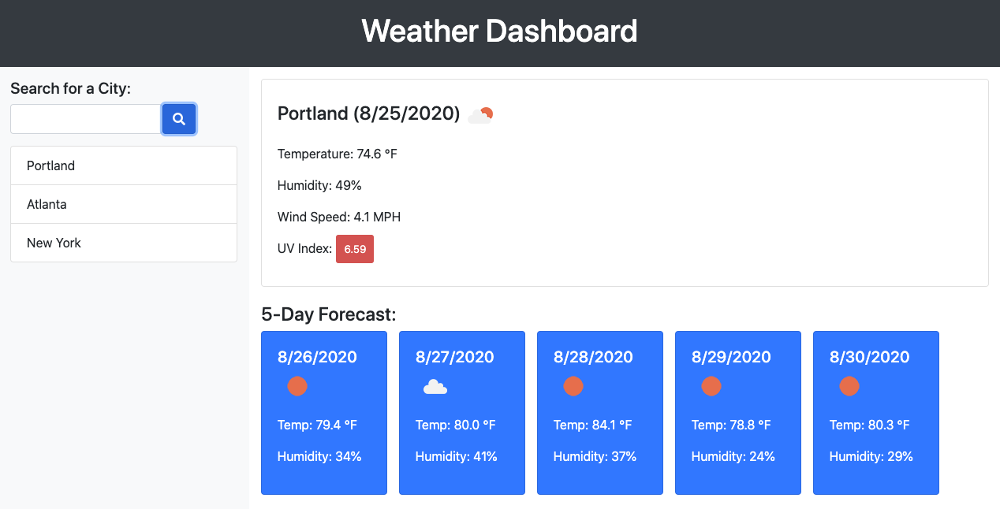

# Weather Dashboard

## Description
An [OpenWeather API](https://openweathermap.org/api) app that retrieves and displays dynamically updated HTML/ CSS weather data for cities.

TECHNOLOGIES: JavaScript, jQuery, HTML5, CSS3, AJAX, Server-Side APIs

## Table of Contents
* [Summary](#summary)
* [Deployed](#deployed)
* [Images](#images)
* [License](#license)
* [Contributing](#contributing)
* [Questions](#questions)

## Summary
Users are able to search for a city and are presented with current and future conditions for that city and that city is added to the search history. Search results include city name, the date, an icon representation of weather conditions, the temperature, the humidity, the wind speed, the UV index (color coded to indicate whether the conditions are favorable, moderate, or severe), and finally a 5-day forecast.

## Deployed
[Weather Dashboard App Link](https://humblekind.github.io/weather-dashboard/)

## Images

## License
This application is covered under the **MIT** license. A short and simple permissive license with conditions only requiring preservation of copyright and license notices. Licensed works, modifications, and larger works may be distributed under different terms and without source code.

## Contributing
Please refer to the [Contributor Covenant](https://www.contributor-covenant.org/version/2/0/code_of_conduct/).

## Questions
Please direct any questions regarding this application to the developer @[HumbleKind](https://github.com/HumbleKind) (GitHub), or via email at christian_sinai@me.com.
